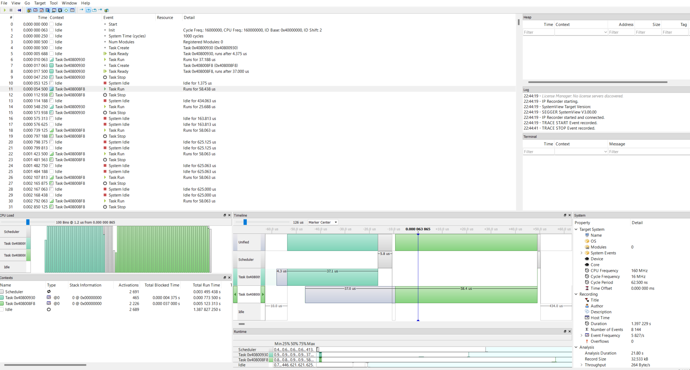
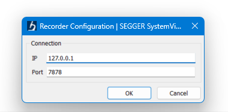

# Experiment

Visualize embassy task scheduling in System View.

## How

- Run the example via `cargo esp32c6`
- Run the server via `cargo run --release -- --chip=esp32c6` - it will connect via probe-rs
- Run SystemView
    - Target / Recorder Configuration / IP
    - IP 127.0.0.1 / PORT 7878

